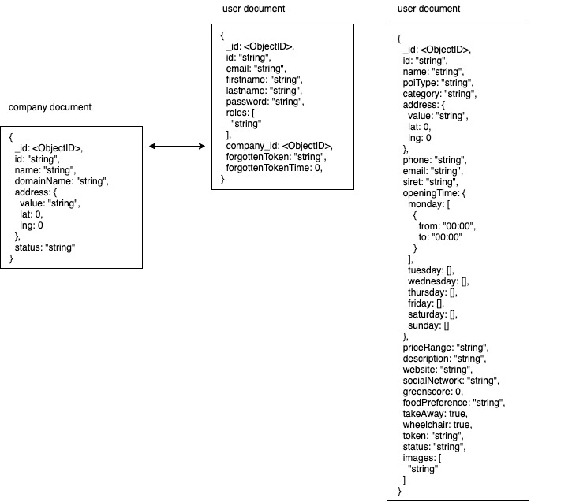

<p align="center">
  <a href="http://nestjs.com/" target="blank"></a>
</p>


# Description

Madu is a digital map that references ecoresponsible addresses (activities, restaurants, shops) and evaluates their environmental impact through a greenscore.

# Argumentation file

## Backend developer

* Corentin Croizat

## Used technologies

* **Node.js** is designed to build scalable network applications.
* **TypeScript** is a typed superset of JavaScript that compiles to plain JavaScript.
* **MongoDB** is a general purpose, document-based, distributed database built for modern application.

## Database schema



## Used libraries

* **NestJS** is a framework for building Node.js server-side applications. It is on top of ExpressJS, fully supports TypeScript and use MVC pattern.
* **Passport** is an authentication middleware for Node.js.
* **Mongoose** is an  mongodb object modeling for node.js.
* **Swagger UI Express** can generate API docs from express.
* **Bcrypt** is a library to help you hash passwords.
* **Helmet** can help protect your app from some well-known web vulnerabilities by setting HTTP headers appropriately.
* **Express CORS package**, cross-origin resource sharing (CORS) is a mechanism that allows resources to be requested from another domain.
* **Express-rate-limit** is used against brute-force attacks.
* **class-validator** is used to validate data.
* **RxJS** is a library for reactive programming using Observables, to make it easier to compose asynchronous code.
* **Multer** is a node.js middleware for handling multipart/form-data, which is primarily used for uploading files.

## Authentication and permissions

You can see the AuthModule [here](./src/auth).

### Authentication

Authentication is an essential part of most applications. **Passport** is the most popular node.js authentication library, well-known by the community and successfully used in many production applications. Passport has a rich ecosystem of **strategies** that implement various authentication mechanisms. For this use case, clients will **start by authenticating with a username and password** using the local startegy. Once authenticated, the server will issue a JWT that can be sent as a **bearer token in an authorization header** on subsequent requests to prove authentication, that's the jwt strategy. 

### Authorization

Now that our user is authenticated, we need to verify his credentials.
**Guards** have a single responsibility. They determine whether a given request will be handled by the route handler or not, depending on certain conditions (like permissions, roles, ACLs, etc.) present at run-time. In our case, we use a guard that permits access only to users with a **specific role**, saved in the user.

## Deployment

The **api** and **swagger's documentation** are deployed on [Madu documentation](http://madu.mrfvrl.fr:3000).

# Development

## Installation

```bash
$ npm install
```

## Create .env file

```
JWT_SECRET=tototo
SALT_ROUNDS=10
MONGO_URI=mongodb://localhost/madu
```

## Running MongoDB

```
docker-compose up -d
```

## Running the app

```bash
# development
$ npm run start

# watch mode
$ npm run start:dev

# production mode
$ npm run start:prod
```
If your database is empty you can create an admin with `/users/admin`.
After that, you can get a bearer token with `/auth/login`, then call all the routes with the token in Authorization header.

## Documentation

- swagger

While the application is running, open your browser and navigate to http://localhost:3000/.

- Compodoc

You can generate your documentation using the below command ``` npx compodoc -p tsconfig.json -s ``` . Then, open your browser and navigate to http://localhost:8080.
